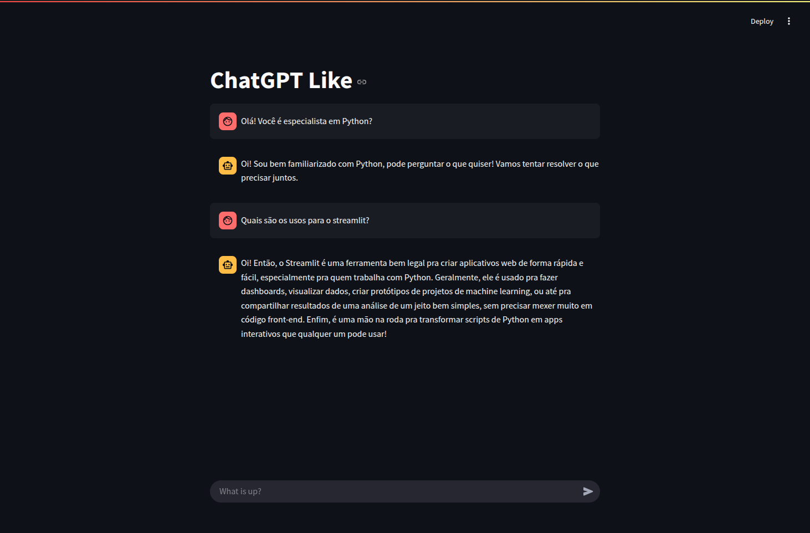

# Chat Streamlit + OpenAI



## Getting Started

### Set up the virtual environment

Create and activate a virtual environment:

```bash
# Create a virtual environment (using venv)
python3 -m venv .venv

# Activate the virtual environment
# On Windows
.venv\Scripts\activate
# On macOS/Linux
source .venv/bin/activate
```

Then, install the required dependencies:

```bash
pip install -r requirements.txt
```

### Create the 'secrets.toml' file

Copy the sample secrets file and fill in your secret values:

```bash
mkdir .streamlit
cp secrets-sample.toml .streamlit/secrets.toml
# Then edit secrets.toml to add your secrets
```

Alternatively, manually create the secrets.toml file inside the .streamlit folder based on the secrets-sample.toml file.

### Run the development environment

Start the Streamlit app with:

```bash
streamlit run streamlitGPT.py
```
